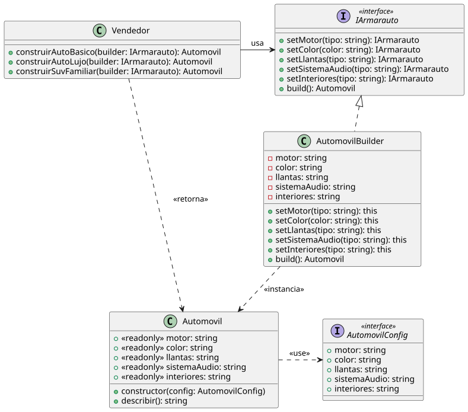

# Scenario One

## Escenario
> Imagina que estás desarrollando una aplicación para una compañía automotriz que permite
> a los clientes personalizar y ordenar un automóvil. Un objeto Automóvil puede tener muchas
> configuraciones opcionales: tipo de motor, color, llantas, sistema de sonido, interiores,
> techo solar, navegación GPS, etc.

## Patron de Diseno 
Para solucionar el problema que nos plantea este escenario hemos decidido usar un patron Creacional: [Builder](https://refactoring.guru/design-patterns/builder).

Este patron nos permite separar la creacion del automovil en pasos y de esa forma agregar partes cuando se necesitan sin tener que crear multiples clases para representar las configuraciones posibles y tambien evitamos tener un constructor con muchas opciones las cuales no siempre se van a usar.

Al tener un builder logramos brindarle al user la opcion de usar cada metodo cuando lo necesita y en un futuro agregar o eliminar opciones de creacion mas facilmente.

## Diagrama de Clases

