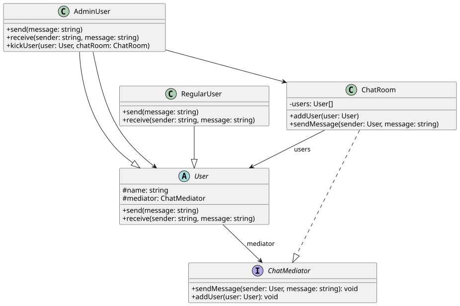

# Scenario Three

## Escenario
> Estás desarrollando una aplicación de chat grupal. Los usuarios pueden enviarse mensajes
> entre sí dentro de una sala de chat. Sin embargo, gestionar las interacciones directas entre
> cada usuario haría que cada uno deba conocer y comunicarse con todos los demás, lo que
> resulta en una alta dependencia entre objetos.

## Problema
> Sin un mediador, cada usuario tendría que mantener referencias directas a todos los demás,
> lo que genera un sistema difícil de escalar y mantener. Si agregas o eliminas usuarios, debes
> actualizar muchas relaciones.

## Patron de Diseno
Para solucionar el problema que nos plantea este escenario hemos decidido usar un patron de comportamiento: [Mediator](https://refactoring.guru/design-patterns/mediator). Esto con el fin de centralizar la logica de comunicacion entre usuarios en un solo objeto (el `ChatRoom`), evitando que cada usuario mantenga referencias directas a los demas. De esta forma, agregar o eliminar usuarios no requiere modificar los existentes, se reduce la complejidad de las interacciones punto a punto y la logica de comunicacion queda organizada en un solo lugar.

## Diagrama de Clases

