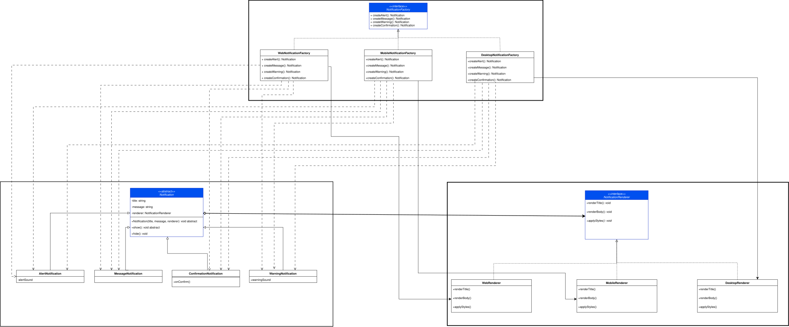

# Scenario Two

## Escenario
> Estás desarrollando una aplicación que gestiona la visualización de notificaciones en
> diferentes plataformas (por ejemplo: escritorio, móvil, web). Las notificaciones pueden ser
> de distintos tipos (mensaje, alerta, advertencia, confirmación) y cada tipo puede mostrarse
> de distintas formas según la plataforma.

## Patron de Diseno 
Para solucionar el problema que nos plantea este escenario hemos decidido usar una mezcla entre un patron estructural: [Bridge](https://refactoring.guru/design-patterns/bridge) y un patron creacional: [Abstract Factory](https://refactoring.guru/design-patterns/abstract-factory).

Con el fin de facilitar la creacion de nuevas clases sin depender de herencia para todo y en el futuro agregar facilmente nuevas clases y plataformas, haremos uso tambien de la composocion para mejorar la mantenibilidad y modularidad de nuestro codigo.

### Bridge
Usaremos el patron bridge pues nos permite separar la abstraccion e.g notificacion, de las implementaciones de esta, que en este escenario son las plataformas.

### Abstract Factory
Usando este patron de diseno vamos a tener una interfaz con la cual crearemos objetos que estan relacionados pero no tenemos que especificar sus clases especificas, es decir que podriamos usar la interfaz para crear un renderer para la plataforma web sin que el resto de la aplicacion tenga que saber como y con que creamos este objeto.

## Diagrama de Clases

