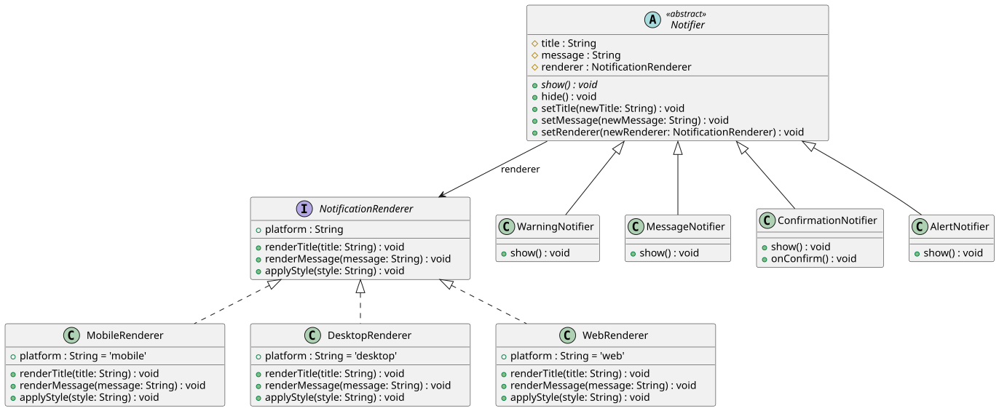

# Scenario Two

## Escenario
> Estás desarrollando una aplicación que gestiona la visualización de notificaciones en
> diferentes plataformas (por ejemplo: escritorio, móvil, web). Las notificaciones pueden ser
> de distintos tipos (mensaje, alerta, advertencia, confirmación) y cada tipo puede mostrarse
> de distintas formas según la plataforma.

## Patron de Diseno 
Para solucionar el problema que nos plantea este escenario hemos decidido usar un patron estructural: [Bridge](https://refactoring.guru/design-patterns/bridge). Esto con el fin de que en un futuro, si necesitamos agregar nuevas plataformas o tipos de notificacion el numero de cambios se reduce, ademas al no usar la herencia clasica logramos reducir el numero de clases apoyandonos de la composicion.

## Diagrama de Clases

